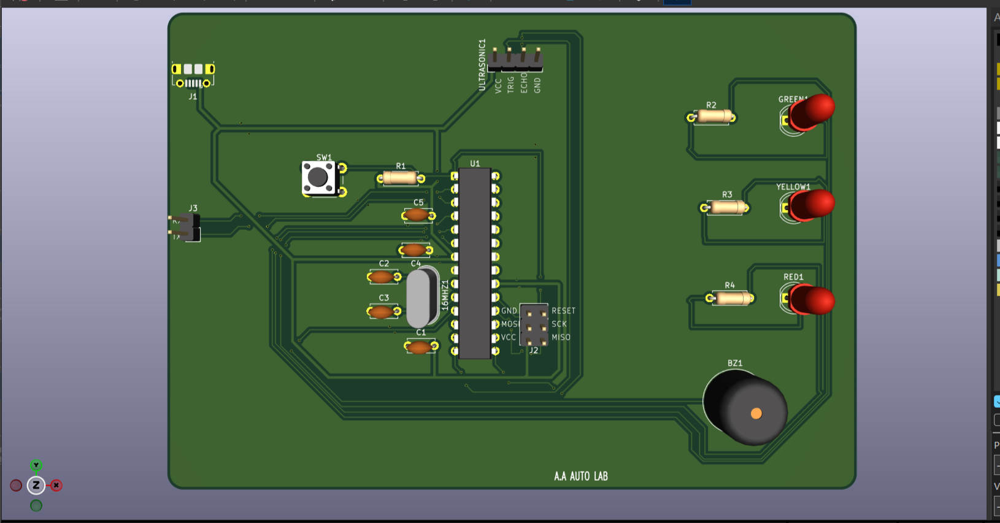
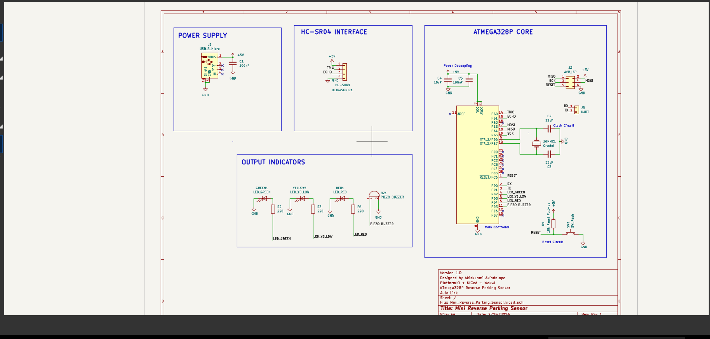
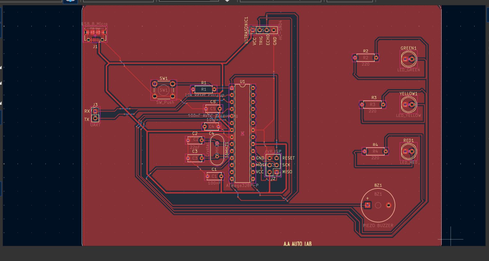
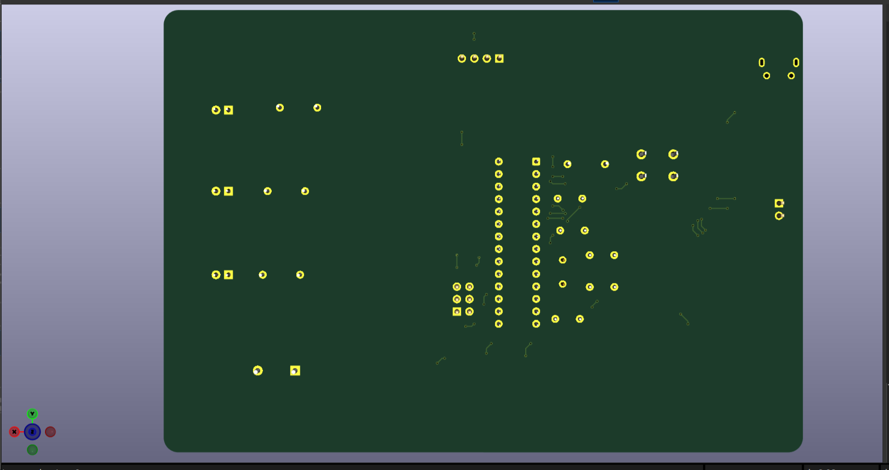
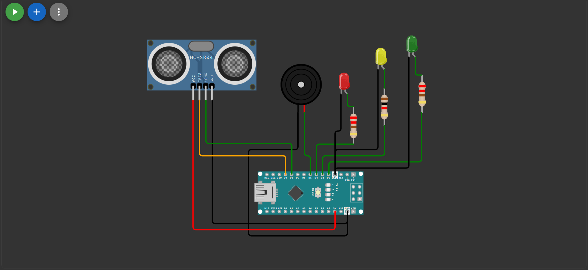

# 🚗 Mini Reverse Parking Sensor

> **A custom ATmega328P-based Reverse Parking Sensor designed using PlatformIO, the Arduino Framework, KiCad, and Wokwi Simulation.**

<p align="center">
  
</p>

---

# 📌 Project Overview

The **Mini Reverse Parking Sensor** is an embedded systems project designed to assist drivers during reverse parking by detecting nearby obstacles using an HC-SR04 ultrasonic sensor.

The system continuously measures the distance between the vehicle and obstacles, providing both **visual feedback** through LEDs and **audible warnings** using a buzzer. The project demonstrates the complete embedded systems development workflow, including firmware development, schematic capture, PCB design, simulation, and manufacturing preparation.

---

# ✨ Features

- 📏 Real-time obstacle distance measurement
- 🚦 Multi-level LED distance indication
- 🔊 Audible buzzer warning
- 🧠 ATmega328P microcontroller
- 💻 Firmware developed with PlatformIO
- 📐 Custom PCB designed in KiCad
- 🧪 Wokwi online simulation
- 🏭 Manufacturing-ready Gerber files

---

# 🔧 Hardware Components

| Component | Description |
|-----------|-------------|
| ATmega328P | Main Microcontroller |
| HC-SR04 | Ultrasonic Distance Sensor |
| LEDs | Distance Indicators |
| Piezo Buzzer | Audible Warning |
| AVR ISP Header | Programming Interface |
| UART Header | Serial Communication |
| Capacitors | Power Supply Filtering |
| Resistors | Current Limiting |

---

# 🛠 Software & Tools

- Visual Studio Code
- PlatformIO
- Arduino Framework
- KiCad 10
- Wokwi Simulator
- Git & GitHub

---

# 📷 Project Gallery

## 🔹 Schematic



---

## 🔹 PCB Layout



---

## 🔹 PCB 3D View (Front)


---

## 🔹 PCB 3D View (Back)



---

## 🔹 Wokwi Simulation



---

# ▶️ Live Wokwi Simulation

You can run the complete project online using Wokwi.

🔗 **Project Link**

https://wokwi.com/projects/470446346962711553

The simulation allows you to:

- Inspect the wiring
- Execute the firmware
- Observe LED responses
- Observe buzzer behaviour
- Understand the complete system before hardware fabrication

---

# 📁 Repository Structure

```text
Mini-Reverse-Parking-Sensor/
│
├── src/
├── include/
├── platformio.ini
│
├── hardware/
│   ├── KiCad_Project/
│   └── Gerbers/
│
├── Simulation/
│   └── README.md
│
├── Images/
│   ├── schematic.png
│   ├── pcb_layout.png
│   ├── pcb_3d_front.png
│   ├── pcb_3d_back.png
│   └── wokwi_simulation.png
│
└── README.md
```

---

# 🏭 PCB Manufacturing

The PCB was designed using **KiCad 10**.

Production-ready Gerber files are available in:

```text
hardware/Gerbers/
```

These files can be uploaded directly to PCB manufacturers such as:

- JLCPCB
- PCBWay
- Seeed Studio Fusion
- OSH Park

---

# 🚀 Future Improvements

Future versions of this project may include:

- OLED display for live distance visualization
- PWM-controlled buzzer
- Waterproof ultrasonic sensor
- Automotive-grade voltage protection
- Surface-mount PCB version
- Low-power sleep mode
- Automatic activation through reverse gear detection

---

# 👨‍💻 Author

**Akinkunmi Akindolapo**

- B.Sc. Physics
- NCE Automobile Technology
- Embedded Systems Enthusiast
- PCB Designer
- Robotics & Automotive Electronics

GitHub:

https://github.com/Akinlatauto19

---

# ⭐ Acknowledgements

This project was developed as part of my continuous learning journey in **Embedded Systems**, **PCB Design**, and **Automotive Electronics**.

---

> *"Every great embedded system starts with an idea, a schematic, and the determination to keep improving."*